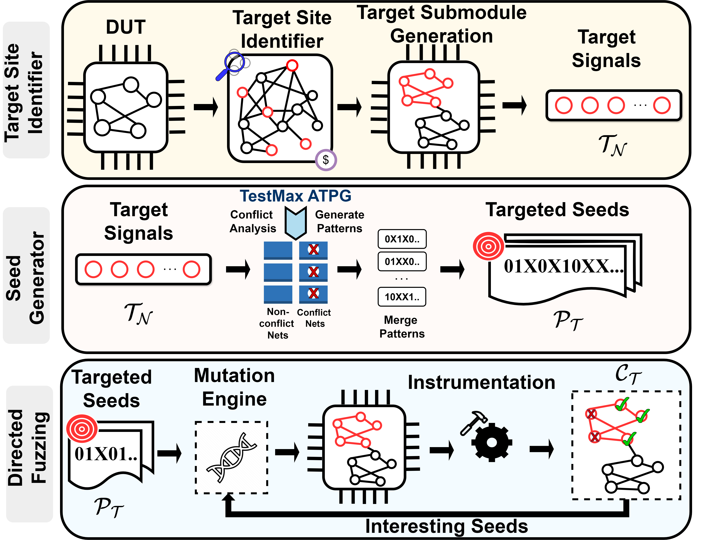

# PROFUZZ: Directed Graybox Fuzzing via Module Selection and ATPG-Guided Seed Generation
This repository contains the artifacts accompanying our paper titled **PROFUZZ: Directed Graybox Fuzzing via Module Selection and ATPG-Guided Seed Generation**, which has been accepted for publication in *2025 IEEE/ACM International Conference on Computer-Aided Design (ICCAD'25)*.

This artifact repository includes the following:
* Tcl Scripts for directed pattern generation leveraging Synopsys TestMax ATPG
* Python Scripts for automating diverse tasks: Target Site Selection, Submodule Generation, Fuzzing Coverage, etc.
* The GSCL45nm standard cell library used for synthesis and simulation

Please cite our work as follows:

**BibTeX**
```
@INPROCEEDINGS{profuzz,
  author={Saravanan, Raghul and Paria, Sudipta and Dasgupta, Aritra and Bhunia, Swarup and P D, Sai Manoj},
  booktitle={2025 IEEE/ACM International Conference on Computer Aided Design (ICCAD)}, 
  title={PROFUZZ: Directed Graybox Fuzzing via Module Selection and ATPG-Guided Seed Generation}, 
  year={2025},
  volume={},
  number={},
  pages={},
  doi={}}
```

**Text**
```
R. Saravanan, S. Paria, A. Dasgupta, S. Bhunia, and Sai Manoj P. D., "PROFUZZ: Directed Graybox Fuzzing via Module Selection and ATPG-Guided Seed Generation," 2025 IEEE/ACM International Conference on Computer Aided Design (ICCAD), Munich, Germany, 2025.
```


## Overview

**PROFUZZ** is a Directed Graybox Fuzzing (DGF) framework that integrates Automatic Test Pattern Generation (ATPG) for precise and scalable seed generation for targeted selection supporting cross-module verification. **PROFUZZ** operates at the hardware’s native abstraction level, enabling accurate capture of intrinsic hardware behaviors and the application of hardware-relevant coverage metrics.

**PROFUZZ** comprises three components: **(1) Target Site Identifier**, **(2) Seed Generator**, and **(3) Directed Fuzzing**, as decpited in the following figure.

<div align="center">
  
  <p><em>Fig: Overview of <b>PROFUZZ</b> methodology highlighting major steps.</em></p>
</div>


For additional details, please refer to our paper. 
You may also access the arXiv version of the [paper](https://arxiv.org/pdf/2509.20808), which is a pre-publication version (note that this is not the final published version).

## Getting Started

The directory tree look something like:
```console
.
├── atpg_seed_gen
│   └── get_id.tcl
    └── get_patterns.tcl
    └── merge_patterns.py
├── cost_functions
│   ├── percent10
│   │   ├── <design>
│   │   │   ├── base_coverage.txt
│   │   │   ├── <design>_conflict_nets.txt
│   │   │   ├── <design>_final_pattern.txt
│   │   │   ├── syn_flat_lib_<design>.v
│   │   │   └── target_10_percent.txt
│   └── val_0.3
│       ├── <design>
│       │   ├── base_coverage.txt
│       │   ├── <design>_conflict_nets.txt
│       │   ├── <design>_final_pattern.txt
│       │   ├── syn_flat_lib_<design>.v
│       │   └── target_0.3_threshold.txt
├── Fuzz_Scripts
│   ├── atpg_flip.py
│   ├── atpg_mutate.py
│   ├── atpg_placeholder.py
│   ├── atpg_simulation.py
│   ├── base_coverage.py
│   ├── fuzz_mutate.py
│   ├── fuzz.py
│   ├── imc.tcl
│   └── instrument.tcl
├── random_selection_fulldesigns
│   ├── <design>
│   │   ├── base_coverage.txt
│   │   ├── <design>_conflict_nets.txt
│   │   ├── <design>_final_pattern.txt
│   │   ├── syn_flat_<design>.v
│   │   └── target.txt
├── README.md
├── submodule_generation
│   ├── main_target.tcl
│   ├── node_extraction.py
│   ├── sub.py
│   ├── sub.tcl
│   └── submodule.tcl
├── subtarget_version
│   ├── <design>
│   │   ├── base_coverage.txt
│   │   ├── <design>_conflict_nets.txt
│   │   ├── <design>_final_pattern.txt
│   │   ├── interesting.txt
│   │   ├── main_target.txt
│   │   ├── sub_target.txt
│   │   ├── submodule.v
│   │   ├── syn_flat_main_<design>.v
│   │   └── target_final_pattern.txt
└── Target Selection
    └── node_extraction.py
```
Here, *\<design\>* correspond to the design under test (DUT). Please refer to our paper for more details about the evaluation benchamrks.

## Artifact Details

The source code of **PROFUZZ** is currently protected under copyright by George Mason University and the University of Florida, which imposes restrictions on publicly releasing or directly sharing the code. Furthermore, **PROFUZZ** integrates with several commercial Electronic Design Automation (EDA) tools, such as Cadence Genus, Cadence Xcelium, and Synopsys TestMax ATPG, that require valid commercial licenses. Due to these licensing and copyright constraints, the complete PROFUZZ toolflow cannot be distributed or made open-source at this time.

However, We have endeavored to provide generic automation scripts and partial Python implementations that illustrate the workflow and can assist researchers in replicating or adapting the **PROFUZZ** automated toolflow within their own licensed environments.

### ToolFlow 

* "**Target Site selection**" 

  * Random Selection: Run node_extraction.py under Target Selection folder. For a given rtl code, the code will generate target.txt.

  * Cost Function-based Selection: The **cost function** is defined as a *design-independent* function of structural information such as **fan-in (FI)** or **fan-out cone (FO)** sizes, and stochastic properties such as **Shannon entropy (H)**. It is calculated for each edge *i ∈ E* as:
      $$
      C_i = f(\text{FI}_i, \text{FO}_i, H_i)
      $$

    For the cost function-based configuration, we selected target nodes using two criteria: (1) nodes with a cost function value Ci greater than 0.3 and (2) nodes within the top 10 percentile of the ranked distribution. The computed cost function values for all nets across the evaluation designs are provided in the cost_functions directory. This directory contains two subfolders: val_0.3/ and percent10/, corresponding to cost functions (1) and (2), respectively.
      * target_10_percent: net names with cost function value in top 10 percentile range
      * target_0.3_percent: : net names with cost function value > 0.3

  * Submodule selection: submodule.tcl will read the \<design\> rtl file create a submodule and will emit the following:
    * Full Module file with main and target module(syn_flat_\<design\>.v)
    * target submodule (submodule.v)
    * Sub_target.txt ( the internal wires inside the submodule.v). 
    Note: To generate the sub_target.txt pass the submodule.v through node_extraction.py and make changes to the variable percentage=100% as the all the internal signals are to be considered
    * Main_target.txt : this is the signals in the main/top module. This will be automatically generated. 

* "**ATPG-guided seed generation**"
  * The Tcl scripts under atpg_seed_gen folder can be updated accrodingly and used to generate the directed patterns to activate the target sites. It is a two step process as follows:
    * Generating hierarchical ‘ID’: Follow the commands get_id.tcl file and update the design path accordingly to generate the hierarchical IDs of target nets. This will generate tmax_data_nets.log file which can be parsed to extract the respective IDs of each target net.
    * Generating activation pattern: Follow the commands get_pattern.tcl file and update the design path accordingly to generate the activation patterns of target nets. These patterns can be merged to maximize the number of target sites activation.  

    **PROFUZZ** employs conflict-PI analysis and fan-in-cone analysis for identifying conflicting nets and merging the non-conflicting test patterns to obtain the seed pattern. The source code for conflict-PI analysis and fan-in-cone analysis can not be made available due to copyright constraints. The python code for merging non-conflicting patterns (merge_patterns.py) is included for reference.

    **\<design\>_final_pattern.txt** and **\<design\>_conflict_nets.txt** under *\<design\>* subfolder for different configurations contains the merged patters with maximum target sites activation and list of conflicting nets for a given *\<design\>*, respectively.

    Please note that for submodule-based selection, this process becomes iterative (or two-stage). In the first iteration, seed generation is performed for the targeted submodule, and the resulting seeds are then used in the second iteration for the main module seed generation process.


* "**Directed Fuzzing and Coverage**"
  * fuzz.py will automatically invoke the tool and dump coverage values. The target sites coverage should be updated in base_coverage.py and the intersesting seeds will be logged in  **\<design\>interesting.txt.** A comment is given to update based on the target site selections. The coverage threshold is set to 90% in the fuzz.py, which can be altered based on the user needs. 


### Standard Cell Library

The gate-level netlists are mapped to GSCL45nm standard cell library for typical/nominal operating conditions. The synthesis and simulation library files used by **PROFUZZ** are shared in the "**./lib/gscl45nm/**" directory:
* "**syn/*gscl45nm.db***" : The synthesis library in *Synopsys DB* format.
* "**sim/*gscl45nm.v***" : The functional simulation library for simulations.

## Disclaimer
This tool is intended for academic research purposes and has been developed with certain assumptions. As an academic tool, performance may vary based on benchmarks, input data, EDA tool versions, and use cases, particularly when applied to designs or tool versions not covered in the evaluation.
Due to varying design and verification requirements, the toolflow may need adjustments to support different use cases. 

## License

This repository is distributed under the Apache-2.0 license.

## Contacts

If you have any queries, please feel free to contact us:
* Raghul Saravanan @ <rsaravan@gmu.edu>
* Sudipta Paria @ <sudiptaparia@ufl.edu>

